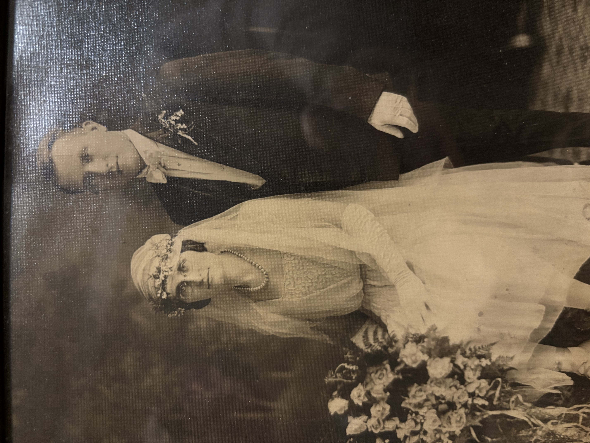
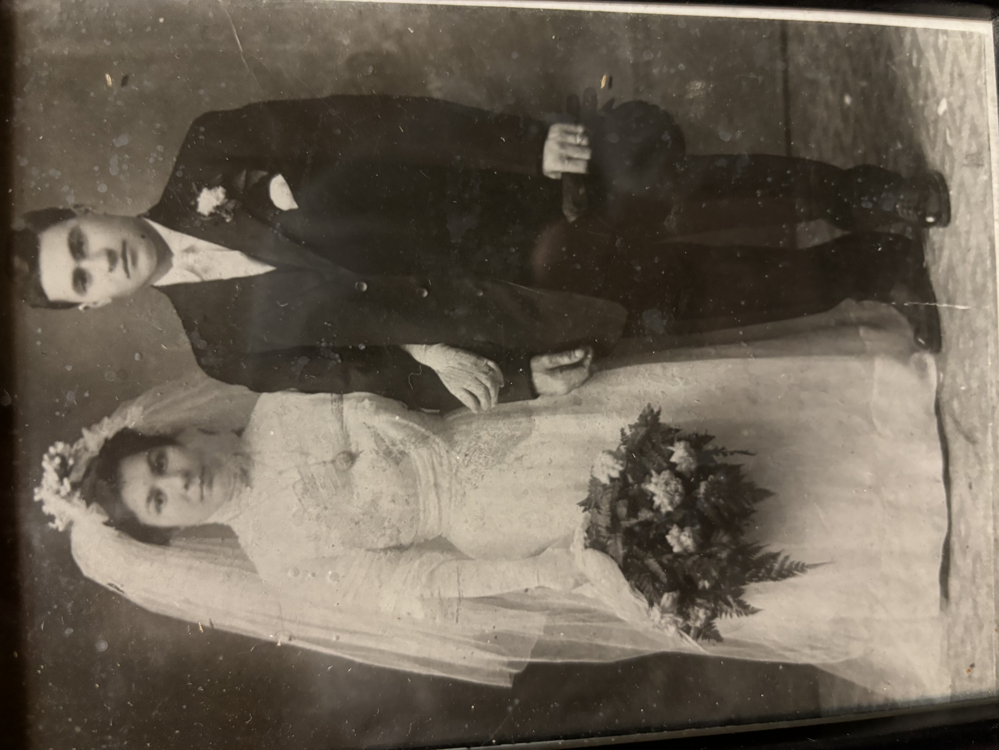
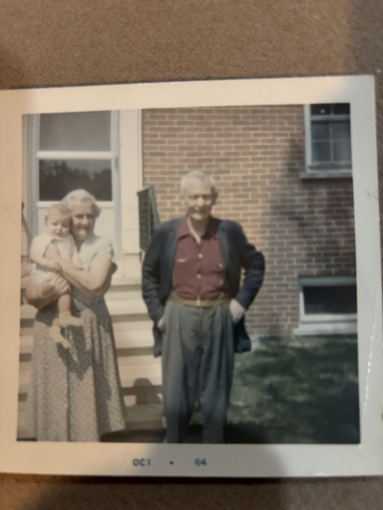

&nbsp;&nbsp;&nbsp;&nbsp;&nbsp;&nbsp;I grew up in Downers Grove IL, a suburb of Chicago where it took only an hour train ride (or less with the express) to make it to Chicago’s Union Station. Downers Grove is a very well-off place with large homes, excellent public schools, a bustling downtown where the high school marching bands hold a Christmas Tree lighting ceremony each year and where I had my wife’s wedding ring hand-crafted. My father would tell me stories from his childhood growing up in Downers Grove, pointing out the things that have changed (almost every single business except a florist) and those that have not (the baseball field next to the train tracks at Gilbert Park). His father built their house with his own hands, and my cousin still lives there to this day. When you picture the typical American suburb, Downers Grove is just about exactly what you imagine. So as I reminisce about how I grew up, the scientist within me can’t help but think about the incredible series of events that happened to lead to me being able to call Downers Grove home. My father had to meet my mother in college at Urbana-Champaign, where she also grew up not that far away in Westchester. For my parents to meet, they had to be supported by their parents and sent to college despite neither of my mother’s parents completing college. In order for my grandparents to support my parents, my grandparents had to meet, and so on in an increasingly improbable series of events. My cousin on my father’s side has researched our family history, and so I am fortunately able to benefit from the hard work that he has put in to trace back our family tree. On my father’s side, we can trace back his father’s family’s journey to America from Germany in the 1850s where the family eventually landed in southern Illinois. There, my father’s grandfather worked as a mechanical operator for the ventilation systems in the coal mines. My father’s mother was Finnish and was the first generation born in the United States after her parents crossed the Atlantic Ocean and went through Ellis Island in the early 1900s where they listed their intentions of working as a housemaid and a tool and die worker. Similarly, on my mother’s side, both of her parents were the first generation born in the United States and arrived from Sicily around the same time shortly before Italian immigration was severely restricted. Each of them, not having more than a few dollars to their names and barely any words of English. Yet within three generations, their descendants would go on to become deeply interwoven into the tapestry of America; they would buy homes, serve in the US Military (my maternal grandfather and paternal uncle in the Navy and paternal grandfather in the Army), become world-class athletes (my cousin), scientists (myself and my cousins), lawyers (my father), computer scientists (my brother), healthcare professionals (my aunt), teachers (my cousin), and pay millions of dollars per year in taxes alone to support our local communities and the US government that took them in. In terms of business, more than a ten-thousand fold return on investment is pretty good to say the least, and that is not even counting the money spent at local businesses and jobs created as a result of their labor such as my paternal grandfather’s family’s work to build the community’s YMCA building.

&nbsp;&nbsp;&nbsp;&nbsp;&nbsp;&nbsp;I am thankful for the opportunities that this country has provided me and my ancestors and for our ability to give back. I am absolutely fascinated by how myself and my family came to be just a handful of generations later. But one thing that I began to learn as I dove into my family tree was not just the names and occupations of my ancestors, but the context and history of the country that they lived in. There is a saying that history never repeats itself, but it does rhyme. And as I learned more and more about what my ancestors went through, I no longer think that saying is true. Rather, history is a game of Mad Libs where the sentences are mostly already written out, the nouns and a handful of verbs are just swapped out to fit the decade. I invite the reader to pause and take a moment to fill in the Mad Lib with what the word of this decade when something sounds familiar.

&nbsp;&nbsp;&nbsp;&nbsp;&nbsp;&nbsp;The road to creating a prosperous life in America was never easy for my ancestors. On the German side, the Know Nothing Party (named for the response its members were supposed to give when asked about the details of the party, “I know nothing”) was a prominent political movement that had strong opinions about my family being there. The Know Nothing Party said that Germans, along with the Irish, were bringing Catholicism to the United States in an effort to destroy religious and civil liberties of Protestants and therefore take over the government by mass-recruiting voters that would defer to whatever the local Catholic bishop said. In fact, one of the first pictures that [the Wikipedia page includes about the Know Nothing Party](https://en.wikipedia.org/wiki/Know_Nothing) is a political cartoon from the era depicting an Irishman and a German wearing barrels of alcohol running away with a ballot box to steal the election. That sounds like Mad Libs to me!

&nbsp;&nbsp;&nbsp;&nbsp;&nbsp;&nbsp;In this context, my German ancestors first arrived and settled on the East Coast, in Baltimore, where the Know Nothing Party had a strong presence. My great great great grand uncle August (Justus) Brethauer kept a diary where he compiled the stories of his father Wilhelm’s and Wilhelm’s father’s journey from Germany to Baltimore, which was later translated from German to English by one of his descendents. If you wish to read the full text of the relevant story that was transcribed by my grandfather, I will include it at the end of this work.

&nbsp;&nbsp;&nbsp;&nbsp;&nbsp;&nbsp;It was during this time period of the Know Nothing Party that August wrote that his family fled from Baltimore to southern Illinois while he was a child. As I mentioned earlier, the Know Nothing Party had a strong presence in Baltimore and was fomenting anti-German and anti-Irish sentiment. August summed up the anti-German sentiment as  “the times were very bad just then; especially for the German immigrants, for the “green one”, as they were called by Americans, were oppressed in every way and manner. … \[the times\] had become so much worse for the Germans and the circumstances were such, that no German man dared let himself be seen on the streets if he didn’t want to run the risk of being knocked down. At almost every corner stood a half dozen “rowdies” who watched in the daytime and if a German came along, he could be certain that he would receive a good thrashing if not something worse, in case he was unable to escape.” 

&nbsp;&nbsp;&nbsp;&nbsp;&nbsp;&nbsp;August’s stated fear that being a German in public could lead to violence came true. In 1857, August was a 6 year-old boy and was playing with his friends in the front yard on the sidewalk. It was apparently a sunny day and August was wearing a hat. As they were playing, a person approached, pulled the hat off his head, and then stabbed August without a word, who, again, *was a 6 year-old child*. After being treated for his wounds, the family found out that it was their neighbor that had attacked August without provocation. The neighbor was arrested and put in jail, but the neighbor’s friends and family were furious. A trial was scheduled and as the trial date approached, the neighbor’s friends became more aggressive. It began with them giving loose threats to Wilhelm that should he value his life he should drop the case. The neighbor’s friends then resorted to throwing rocks and other debris at the family house, which then escalated to some of them breaking into the Brethauer home and demanding that the case be dropped at gunpoint, which based on my interpretation of the diary seemed to have been fired at Wilhelm but missed.

&nbsp;&nbsp;&nbsp;&nbsp;&nbsp;&nbsp;Wilhelm refused to drop the case, and August does not say much about the trial itself other than it came and went with the neighbor being sentenced to one year in prison, which, as August wrote, caused the neighbor’s mob to seek revenge. Before the neighbor’s mob could enact that revenge, Wilhelm wrote to some family members in Belleville, Illinois who had joined a community of German immigrants, begging them to send money to help them escape. The Belleville family sent $50, and the family prepared to leave Baltimore in secret. The family feared that if their neighbors and the mob caught wind that they were moving, they would have been attacked and prevented from leaving. Due to the intense anti-German sentiment, August said that ‘not one tear did we shed’ as they got on the train and left, arriving in Belleville in 1858. He later remarks that while the wages in the area were small, “the one good thing here was, that, at any time of the day you could let yourself be seen on the streets without being in danger of being knocked down and robbed.”

&nbsp;&nbsp;&nbsp;&nbsp;&nbsp;&nbsp;For my Sicilian immigrant ancestors, the treatment was similar. The Library of Congress has [a succinct article](https://www.loc.gov/classroom-materials/immigration/italian/under-attack/) that describes the kind of climate that my Sicilian ancestors were stepping into when they arrived in the early 1900s. It describes a time where “Mediterranean types” were said to be inherently inferior, often criminals, and less than human. In fact, there were cartoons that proudly proclaimed “If immigration was properly restricted, you would never be troubled with anarchism, socialism, the Mafia and such kindred evils!” Again, this sounds like Mad Libs to me. But these attacks were not limited to the page, with the burning of Catholic churches and mobs attacking Italian immigrants becoming commonplace. Among the worst incidents was prior to the arrival of my family in 1891 New Orleans, when the chief of police was found shot to death on the street. The mayor of New Orleans declared "Sicilian gangsters" had committed the heinous crime and rounded up more than 100 Sicilian Americans. Eventually, 19 were put on trial and were found not guilty for lack of evidence. Before they could be freed, however, a mob of 10,000 people broke into the jail. They dragged 11 Sicilians from their cells and lynched them, including two men jailed on other offenses.

*A picture from my mother's maternal grandparent's wedding, Angelina and Antonio Pavia.*

&nbsp;&nbsp;&nbsp;&nbsp;&nbsp;&nbsp;My Sicilian ancestors lived in a close-knit community along with many other Italian immigrants in the neighborhoods surrounding Chicago, which would eventually become the modern day ‘Little Italy’s’ that dot the cityscape. Here, English was not commonly spoken. After all, when all of the immigrants were building communities for themselves for safety against attacks, there was not really much of a need to do so. This is well encapsulated by a story that my mother told me, that she was stunned when she finally had dinner with my father’s family because it was the first time that she had met old people without any accents! Despite starting from communities that did not speak English, Italian culture has become intertwined with American culture and we have all greatly benefited from the food, music, and art this combination has produced.

*A picture from my mother's paternal grandparent's wedding, Jennie and Rosario Cognato.*

&nbsp;&nbsp;&nbsp;&nbsp;&nbsp;&nbsp;Even without intense, specifically anti-Finnish political messaging, my paternal grandmother and her family were not unaffected by the pervasive fog of anti-immigrant sentiment that cloaked the country. Growing up, my paternal grandmother was raised in a household where any sign that you had been born elsewhere was faux pas. She was only taught English, losing the native language of her ancestors and her parents. The anti-immigrant sentiment was so internalized that my paternal grandmother supposedly had to forge her parent’s signature when bringing home her report card, not because she wanted to hide her grades but because her mother refused to sign fearing her signature and name were ‘too ethnic.’

*A picture from my father's maternal grandaprents, Ellen and Alvar Eklov, in front of their house holding my father who is around one year old.*

&nbsp;&nbsp;&nbsp;&nbsp;&nbsp;&nbsp;With all of the family history that I know now, I keep coming back to the notion of just how improbable it is that I am here and able to write this piece. What if my German ancestor had died as a result of the stabbing that evidence suggests was propelled by the Know Nothing Party decrying the threat of Catholic German immigrants? What if it was one of my Sicilian ancestors had been wrongly accused of a crime and then lynched by a mob? Or what if the anti-German fervor had been so intense that my ancestors decided to leave the United States entirely, or if the US government took action on the anti-German sentiment and started to push them out? The last sentence in particular sounds like Mad Libs. My ancestors did not have to worry about Immigration and Customs Enforcement (ICE) or the Department of Homeland Security (DHS); both of them were formed in 2002 from the same bill as a response to the September 11 attacks (It was quite a shock to me that the two agencies are younger than me!) While my ancestors had to worry about things like the Know Nothing Party fomenting anti-immigrant sentiment, they did not have to worry about a militarized government force coming to grab them off the streets simply for speaking or looking Italian. What would have happened to my grandfather if he had been grabbed during Sunday mass? What would have happened to my grandmother if she was declared a mafia member because she made spaghetti and meatballs? Unfortunately, I do not have to wonder much because in every single video that comes out of masked ICE officials shoving individuals into unmarked vans, I see my own great grandparents being taken away. If ICE existed nearly 100 years ago, I know, without a doubt, my family would have been targeted. 

&nbsp;&nbsp;&nbsp;&nbsp;&nbsp;&nbsp;It is times like this where I feel helpless to stop the inhuman cruelty being inflicted upon immigrants. If [the Pope can make statements](https://www.pbs.org/newshour/world/pope-leo-calls-for-deep-reflection-about-treatment-of-detained-migrants-in-the-united-states) criticizing the treatment of immigrants and nothing much changes, what good will my words do to push back against the current administration? In the face of overwhelming odds, I remember a story that my wife told me that she learned while taking care of foster children during a yearly summer camp. One day in a sleepy town along a sandy coast, there is a powerful storm. Strong winds whip rain and seawater all over, casting marine life from the ocean onto land high above the water on the beach, stranding them. The following morning, a little boy goes to the coast, where countless starfish lie beached. He begins to pick them up one by one and throw them back into the ocean. An old man walks by and asks the boy, “What are you doing? Can’t you see there are more starfish stranded than you could possibly help? You cannot possibly make a difference here!”
&nbsp;&nbsp;&nbsp;&nbsp;&nbsp;&nbsp;The boy pauses a moment, then picks up another starfish and throws it back into the ocean. “But I just made all the difference in the world for that one starfish,” replies the boy. I aspire to be that boy. Even if these words reach only one more person, to cause them to pause and realize the vicious cycle of anti-immigrant sentiment we as Americans have been living in, then it will have been worth it. The history and context of the journey that my family took to survive an America that wanted to belittle them, harm them, and shame them has emphasized to me just how incredible it is they succeeded in making the US their home and forging a life here. Despite the hatred, violence, and obstacles in their way, their descendents have invested in America more than ten-thousand fold what they had originally put in with taxes alone, not to mention the jobs, the communities, the innovation that were created as a result of their hard work. But understanding that history and context has also brought me to a crucial realization. Simply put, the people that whine about immigrants ruining the country and never contributing anything, often Republican politicians, are lazy. They do not even come up with new ways to demonize immigrants. They just drop in the name of the current ethnic group or minority they do not like and use the same language that people in the past used to decry my ancestors. This is why history is Mad Libs. It is time to break the cycle, and write our own history for once. Call your representatives today and demand that ICE be reigned in. If you do not know who your representatives are, find them and their contact information [here](https://www.congress.gov/members/find-your-member). 

# August's Diary

### Introduction
Translation of our father’s history of our family from the time our grandfather’s emigrated from Niederkaufungen, Germany in the year 1854, down through the years and their trip back to the old home in Niederkaufungen in 1912. Our father kept his promise to mother to take her back to her old home when we children would be able to take care of ourselves.

This is a translation of the Wilhelm Brethauer family history written by August Brethauer (32), youngest of the three children who immigrated to the United States in 1854.

The cast in this story is:
* (26) William - father (Wilhelm Brethauer) born 1813
* (29) Maria - mother (Maria Katharina nee-Vollmar) married 1840
Children - 
* (30) -  Anna (Records show name as Gertrud) born 1840
* (31) - Henry (Johann Jost Henrich) born 1843
* (32) - August (Records show name as Justus) AUTHOR born 1851

Translation of Our Father’s History of Our Family
August Brethauer (31)
Translated from the German

### The Emigration from Germany in 1854

In the following pages, I give a true history of our family, which I hope my descendants will preserve. I have written this down from the stories which my parents related and which, I hope my children and also their descendants will read with interest.

At the beginning of 1850, circumstances for the poor man in Germany were becoming worse and worse. The result was a strong emigration from all parts of Germany. our little village didn’t stay far behind in this either. Already, at the close of the 1840’s and the beginning of the 1950’s, many families emigrated from Niederkaufungen, among them the Kersting’s, Neinemann’s, the Friedrichs and many others.

My Father, after he had attended the village school and had been confirmed, had learned the pavier’s trade. After he had married my Mother, he acquired a piece of land and had a house built on it. In spite of his industrious and thrifty manner of living, he could not seen to get ahead. It was in the year of 1854 that Father and Mother decided to emigrate to America. After they had sold their little property, the proceeds of which was just enough to defray the costs of the trip, they started out for the seaport of Breman, with seven other families namely, the Doering’s, Engel’s, Wampah’s, Viehmann’s, Klingen’s and two families named Witz. At that time, traveling was very laborious since the railroad was still in its infancy and nothing was known then of such large steamships which cross the Atlantic Ocean now. The ocean trip had to be by sailboat. It couldn’t be otherwise. What such a trip means, nobody has an idea who hasn’t himself made a trip across the ocean. One should think of a sailboat that has from two to three hundred passengers abroad and which requires from six to eight weeks to make the trip from Breman to New York, and you have an idea of the hardships. Yes, one might say, of boredom of an ocean trip in those days. All of the emigrants stood the ocean trip. Only Sister Anna was very ill, so I have been told. The Wampah’s and the Viehmann’s separated from the rest of the company in Breman and sailed for New York. Our folks sailed for Baltimore, Md. 

The new, and as all hoped, better home had been reached, but still, in the days that followed, they all had many things to worry about and to contend with. Especially was this the case with my parents. They had. so to speak, nothing any more when they arrived in Baltimore and so they saw disconsolate future before them. To their misfortune, the times were very bad just then; especially for the German immigrants, for the “green one”, as they were called by Americans, were oppressed in every way and manner, and walk around in the town for weeks before they found any work. Although Father tried so hard to find work and did anything he could get, yet he could not earn enough for the family to live on, Mother, also Anna and Henry, had to help. Anna was fourteen years old and went to work as a housemaid. Henry, who was eleven years old, worked for a cigarmaker as a “stripper”, even though he wasn’t through school yet. And I, well, I had to stay at home and frightened them many times and caused them anxiety. How? That I will describe later.

### The First Year

Mother had to contribute a large portion to the upkeep of the family. She did washing for other people, helped in homes of other people and for a long time she milked the cows in a dairy. In her own household, she had little to do, as it consisted only of a few chairs, a bed and a few little thing. Our home had one room and a kitchen. I must not forget to mention, that our parents had a stove.

### Great Insecurity

After a year, the time hadn’t become any better. On the contrary, they had become so much worse for the Germans and the circumstances were such, that no German man dared let himself be seen on the streets if he didn’t want to run the risk of being knocked down. At almost every corner stood a half dozen “rowdies” who watched in the daytime and if a German came along, he could be certain that he would receive a good thrashing if not something worse, in case he was unable to escape. Father found himself in such a situation several times, although, since he was quite well acquainted with it, he managed to escape, but not without hearing the unpleasant call behind him, “that was a Dutchman”.

### Father Breaks a Leg

We were in Baltimore about two years when Father had a bad accident. He had found work in a lumber yard. One day, he and another man were carrying a heavy board. In some way our Father stumbled, the board began to sway and – it fell on his left leg. The result was, his left leg was broken. He was brought home and had to lie in bed for weeks before he recovered enough so he could go back to work again. In the meantime, naturally, we had nothing to live on and, if kindhearted people hadn’t taken pity on us, then, many a time, we wouldn’t hardly have had a bite to eat. At this time, they had an opportunity at least to earn a little. Father became a tailor. An order from a large clothing store to make work trousers, and he seems to have completed them to great satisfaction. Everything Father undertook, he did gladly and with love for the work. This work he could do at home and in this way he did not need to strain the broken leg so much. The pay for this work was very small; nevertheless, they could keep the wolf from the door. Of course, Anna and Henry also earned something, but, it wasn’t enough.

### Bitten by a Dog

Now I want to report on things that happened to me, personally, and over which my Father, Mother, Sister, and Brother, had to endure so much anxiety and unpleasantness. I was six years old. Our neighbors had a large female dog (I think it was a Newfoundland) which had several puppies. This, of course, was nothing unusual. One day, several other boys and I were playing with each other, near the dog. At last, we came to the puppies and wanted to play with them. I just wanted to pick up one of them when the Mother sprang at me and bit me in the left cheek. Naturally, there was much screaming. Quickly I was brought home where I received the necessary help. Luckily the incident had no bad results for me, for the wound healed quickly and I had only a small scar on the lip to show for it.

### Lost in Baltimore

Since my parents, Sister and Brother were always away from home during the day I was left to my own devices, that is, I hunted company. This incident, which I will relate now, happened soon after the one I just told about.

It was at the time that mother was milking the cows in the dairy. The owner also had a slaughterhouse and so he always had a large herd of cows and sheep which were taken out to pasture outside of the town, each day, by a man. I, naturally, became well acquainted with this man, so sometimes he took me along, although I was forbidden to go with him. One day I had again gone with the man and the herd but this time I wasn’t so lucky to get home. During the day, everything went well, but in the evening, as we were on the way home, in some way, I became separate from them, and now, alone, I wandered around in the big city. At last, I came to a house whose occupants took me in, and where it suited me real well, since the people did all they could to satisfy me. When I did not return home that evening with the shepherd and his herd, my parents, naturally, were very worried. It was the custom in Baltimore, when a child was lost, that they went through the town, along the streets, ringing a cowbell. To this means my parents also had to resort and it brought results. After many hours, Brother Henry found me with this family and brought me home. My parents were overjoyed when I came home with Brother Henry.

### I Almost Drown

After the above episode, one would think I wouldn’t go to the pasture with the shepherd again, but it wasn’t so. Again I had gone out with the shepherd and his herd. During the day we had a heavy downpour of rain and our way home, so to speak, was cut off. My Father had started out as soon as the storm came up to get me and came just in time to pull me out of a ditch filled with water into which I had fallen, and saved me from drowning. It is needless to say that I was wet through. Whether the shepherd and his sheep reached home safely, I don’t remember. At any rate, it was the last I went with him, for he was strictly forbidden to take me along again.

### The Barrel in the Cellar

“An accident seldom comes alone”, says an old proverb and so that happened to me. The owner of the house had a large barrel in the cellar in which water was collected. In this manner, the cellar was to remain dry. The barrel was usually full of water and the floor around it was always moist. This was no secret to us boys. Some of us boys and I got some of this mud and did lots of mischief with it. For a while all went well. But this in itself, harmless amusement, was interrupted in a very unpleasant manner for me. I must have leaned too far over the barrel, and, who should fall into it, but I. The falling in was an easy matter, but to get out again. I couldn’t get out myself. My companions deserted me and if the housewife hadn’t been attracted by my screams and calls for help and the splashing in the cellar, I would undoubtedly have drowned. The good woman rescued me out of the dangerous position and brought me home. I never went into the cellar again.

### An Attack

In the following lines, I want to tell about an occurrence which could have had serious results for us all, but for our Father and which finally was the reason why our parents moved to Belleville, Illinois.

It was in the year 1857, a very bad time again. the emigrated Germans were subjected to all kinds of oppression and could hardly let themselves be seen on the streets if they didn’t want to run the chance of being robbed, slugged or murdered. One day, I was in front of the house with several of the boys, on the sidewalk, playing together. At the time, I was wearing a cap. Just then a “rowdy” came along and, without saying a word, pulled the cap off my head and in the next moment, I had been stabbed. The knife had gone in quite deep, but the fellow had not accomplished his purpose, since the wound proved not to be dangerous. Until the boys told me, I didn’t know that I had been stabbed, It had happened so quickly. They brought me home and a doctor was called. The wound wasn’t so serious and in a few weeks, it was fully healed. Due to this incident, my parents had to endure much worry and anxiety.

### It was Our Neighbor

The assailant was arrested and put in jail. It now became known that his name was Taylor and that he was our next neighbor. Nobody could understand why he should attack me, since I was an innocent child and my parents had no intercourse with him.

### The Events Before the Trial

Days of worry now followed. The prisoner was indicted and the trial should be held soon. The relatives of the criminal and also his “friends”, and, of course, of these there was a larger number, repeatedly asked my Father to let the accused go free, if he valued his life. However, my Father had been told by certain people, under no circumstances to free him, but to let the trial take place. And this my Father did. Through his refusal, though, Father made enemies of the many “friends” of the prisoner and the results soon began to appear. The time of the trial came nearer and nearer and the followers of the prisoner redoubled their efforts to free their “friend”. Since Father didn’t give in to them and stood fast on his refusal, they used other tactics.

### The Bombardment

The house in which we lived, was two-storied, and stood in the rear of the yard. We lived in the upper story. Since all their efforts to free their “friend” had failed, they resorted to as attack and bombarded our home with stones and many other things. Father could no let himself be seen on the streets any more, for these men would undoubtedly have killed him if he had fallen into their hands. Several of the accused’s “friends”, a few days before the trail, even came into our room to force Father to free the prisoner. However, Father stood firm on his refusal and if he hadn’t noticed a suspicious movement and hid quickly behind the stove, the men would have shot him down there in the room. When they realized that they couldn’t make him change his mind, they left with mutterings about the “Dutchman”. The following night was terrible to, since the “rowdies” had planned another attack.

### The Police Are Called

However, we were not without friends and these advised us to call the police. Protection was granted and two policemen were stationed near the house. Sister Anna had to watch the front of the house and as soon as she saw something suspicious, she was to raise an alarm. Anna immediately called; “Watch! Watch!” and from several sides policemen came and the attack was repelled.

### The Trail

About the trial, I am sorry to say, I can report very little. So much I do know, though, that the accused was sentenced to one year in prison. 

The trial was now over and the accused had received his punishment, which was very light. But the danger was not over for us, for his “friends” were still more embittered toward us and wanted revenge at any price.

### Now What

Good advice was now “dear”. For a long time Father couldn’t earn anything since he didn’t dare show himself on the streets. The “rowdies” were still after him. What little Mother, Anna and Henry earned, hardly reached for the upkeep of the family and there could be no thought of saving anything, insomuch, at that time, wages were very low. Under these circumstances, it was no wonder, that our parents were considering moving to Belleville, Illinois.

### Help from Belleville, Illinois

Father wrote to his relatives in Belleville and begged them to send him money necessary for the trip. They were so kind and sent Father $50.00, with which we could pay the fare for the trip.

### Preparations to Leave Baltimore

When the money arrived, preparations to leave were hurried along. These were soon completed, since our household goods consisted of only a few pieces, so we had little to sell, and so far as I learned, my parents received $10.00 for it. All preparations had to be done in secret and quietly or it could have happened that, at the last minute, we might have been honored with a visit from the “friends” of the man who had been sentenced to prison and we would have been prevented from leaving.

### The Trip to Belleville

Against expectations, everything went along smoothly. We said goodbye to our friends there, but not one tear did we shed over the city of Baltimore. Unmolested we boarded the train that should bring us to a new, and, we hoped, better home. Traveling in those days was not so fast as it is now. Naturally, we didn’t ride on a “fast” train since our money didn’t reach that far, but we traveled on a “emigrant” train.

